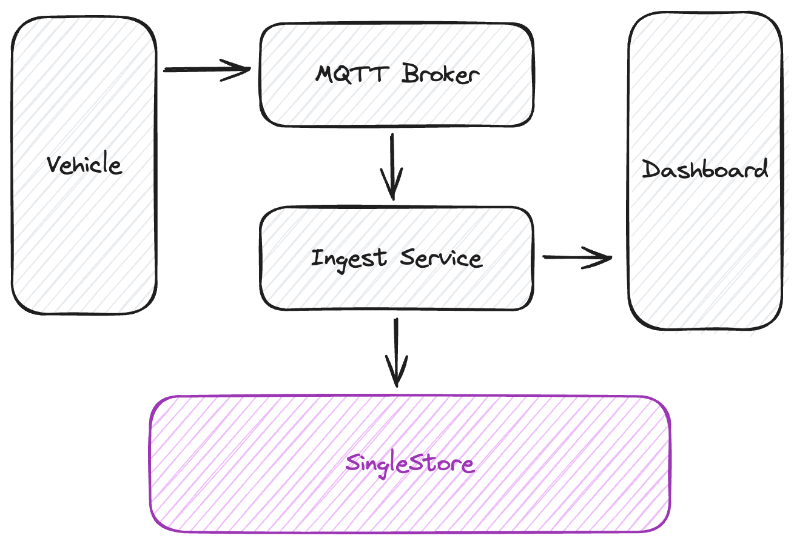
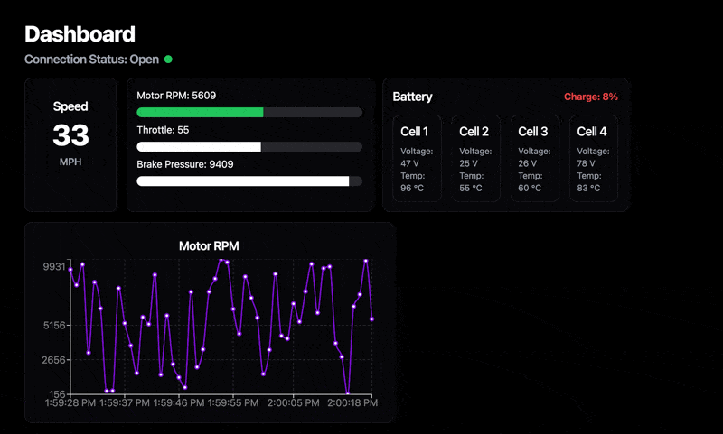

# Building a real-time analytics pipeline for racecars

**Attention**: The code in this repository is intended for experimental use only and is not fully tested, documented, or supported by SingleStore. Visit the [SingleStore Forums](https://www.singlestore.com/forum/) to ask questions about this repository.



An example repository showcasing data being ingested from a vehicle's ECU and Battery nodes, uploaded to SingleStore, and visualized in a dashboard.

## Requirements
- Docker (or just a MQTT broker)
- Golang 1.22+
- Node.js 20+

## Getting started

Start the MQTT broker
```sh
$ docker run -d --name nanomq -p 1883:1883 -p 8083:8083 -p 8883:8883 emqx/nanomq:latest
```

Start the ingest service (make sure to set your SingleStore database credentials in `ingest/db.go`)
```sh
$ cd ingest
$ go run .
```

Start the dashboard
```sh
$ cd dashboard
$ npm run dev
```

Start the test script
```sh
$ cd test
$ go run .
```

Go to [http://localhost:5173](http://localhost:5173) and see all your data!


